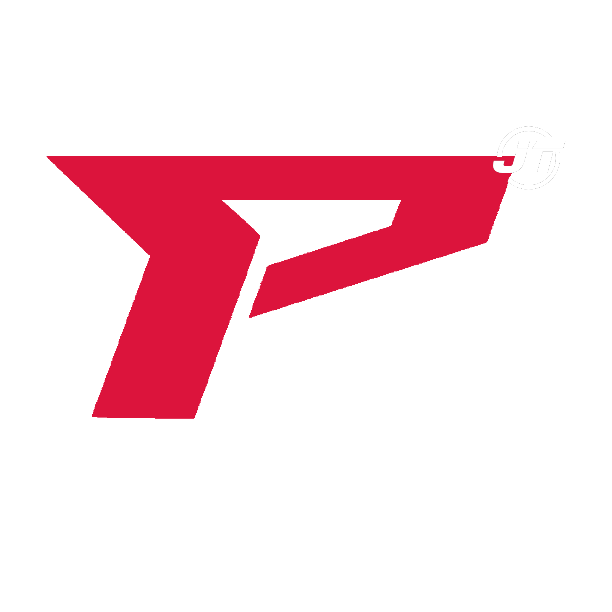

<div id="top"></div>

[![Contributors][contributors-shield]][contributors-url]
[![Forks][forks-shield]][forks-url]
[![Stargazers][stars-shield]][stars-url]
[![Issues][issues-shield]][issues-url]
[![MIT License][license-shield]][license-url]

<br />
<div align="center">
  <a href="https://github.com/HungMiCheo/Prime-Share-Script">
    
  </a>

  <h3 align="center">Prime Share Script</h3>

  <p align="center">
    Nơi đây có những script được chia sẻ bởi RPK Team!
    <br />
    <a href="https://discord.com/invite/Ec2N3dWQpM"><strong>Discord »</strong></a>
    <br />
    <br />
    <a href="https://www.youtube.com/playlist?list=PLBz0qtSMFhTXJQsp47CFGWvv7h3tgBD-8">View Demo</a>
    <!-- ·
    <a href="">Report Bug</a>
    ·
    <a href="">Request Feature</a> -->
  </p>
</div>

## RPK Team

RPK Team đươc thành lập vào năm 2020.
Với mục đích và hướng đi phát triển cộng đồng FiveM Việt Nam.

Đội ngũ chúng tôi gồm có:
<br />
<a href="https://github.com/kjtralf">KaneJt (Boss)</a>
<br />
<br />
<a href="https://github.com/HungMiCheo">Run1St</a>
<br />
<br />
<a href="https://github.com/hktts474941">Rimts</a>
<br />
<p align="right">(<a href="#top">Về đầu trang</a>)</p>

## Prime Share Script

```sh
Tệp này được chúng tôi tạo ra với mục đích chia sẻ tới cộng đồng FiveM Việt Nam những kịch bản được chúng tôi viết lại hoặc được chúng tôi
viết ra.
```
```sh
Những kịch bản này bao gồm tất cả các nội dung xoay quanh FiveM.
```
```sh
Xin đừng thay đổi bản quyền và sử dụng các kịch bản cho mục đích thương mại vì bạn sẽ bị cấm vĩnh viễn nếu chúng tôi phát hiện ra điều này.
```

## Giấy phép

Phân phối theo giấy phép GNU. Xem `License.txt` để biết thêm thông tin.

<p align="right">(<a href="#top">Về đầu trang</a>)</p>

## Liên hệ

Run1St - [Gmail]() - micheohung@icloud.com

Youtube: [MiCheo Hưng](https://www.youtube.com/channel/UCTWcVDAN74G50tkF1v9Gl9A)

<p align="right">(<a href="#top">Về đầu trang</a>)</p>


[contributors-shield]: https://img.shields.io/github/contributors/othneildrew/Best-README-Template.svg?style=for-the-badge
[contributors-url]: https://github.com/HungMiCheo/Prime-Share-Script/graphs/contributors
[forks-shield]: https://img.shields.io/github/forks/othneildrew/Best-README-Template.svg?style=for-the-badge
[forks-url]: https://github.com/HungMiCheo/Prime-Share-Script/network/members
[stars-shield]: https://img.shields.io/github/stars/othneildrew/Best-README-Template.svg?style=for-the-badge
[stars-url]: https://github.com/HungMiCheo/Prime-Share-Script/stargazers
[issues-shield]: https://img.shields.io/github/issues/othneildrew/Best-README-Template.svg?style=for-the-badge
[issues-url]: https://github.com/HungMiCheo/Prime-Share-Script/issues
[license-shield]: https://img.shields.io/github/license/othneildrew/Best-README-Template.svg?style=for-the-badge
[license-url]: https://github.com/HungMiCheo/Prime-Share-Script/blob/main/LICENSE